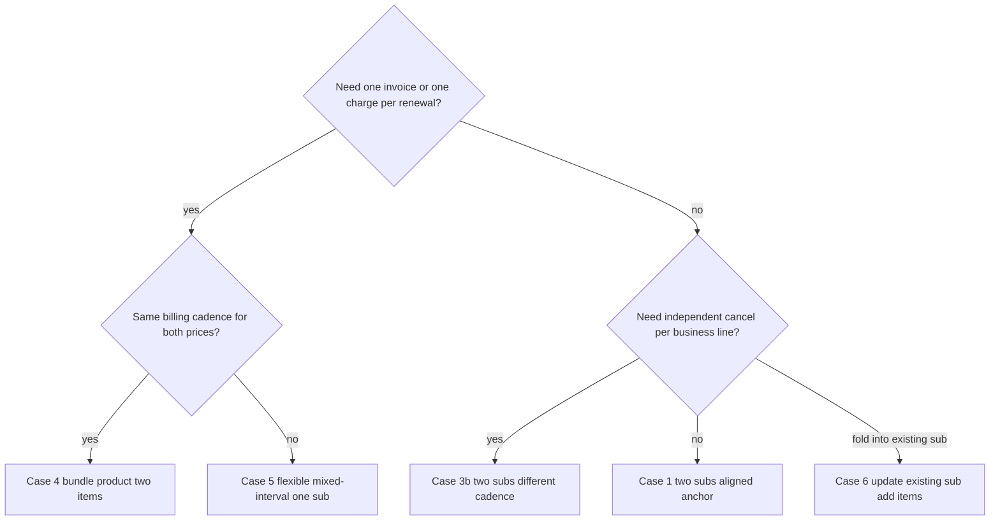

# TeeSwag subscription edge cases (multi-product, multi-subscription)

This document catalogs realistic Stripe Billing shapes when **premium delivery** (`subscription_a` on `prod_a`) coexists with **streaming** (new subscription or new items). It complements [use-cases.md](use-cases.md), which describes what this repo’s scripts implement today.

Official references:

- [Set the subscription billing renewal date](https://docs.stripe.com/billing/subscriptions/billing-cycle) (billing cycle anchor, proration, realignment).
- [Mixed interval subscriptions](https://docs.stripe.com/billing/subscriptions/mixed-interval) (flexible billing mode, combined vs split invoices per renewal).

## Scope and conventions

**Story.** The customer already has **`subscription_a`**: recurring **`price_a`** on **`prod_a`** (e.g. premium delivery). TeeSwag adds streaming via **`price_b`** (flat recurring base) and optionally **`price_b_metered`** (pay-per-view metered price, as in this repo).

**Labels.**

| Symbol            | Meaning                                     |
| ----------------- | ------------------------------------------- |
| `prod_a`          | Delivery product                            |
| `prod_b`          | Streaming product                           |
| `prod_c`          | Hypothetical “bundle” product (Case 4 only) |
| `price_a`         | Delivery recurring price                    |
| `price_b`         | Streaming base recurring price              |
| `price_b_metered` | Streaming PPV metered price                 |

**Invoice scope.** In Stripe Billing, each **`Subscription`** generates its own renewal **`Invoice`** objects (unless you build custom invoicing). Two subscriptions on the same **Customer** mean **two invoice streams**, even if renewal **dates** align. Aligning [`billing_cycle_anchor`](https://docs.stripe.com/api/subscriptions/object.md#subscription_object-billing_cycle_anchor) synchronizes **when** bills happen; it does not merge two subscriptions into one invoice.

---

## Default proration behavior

Stripe’s default for subscription create/update is **`proration_behavior: create_prorations`** unless you override it. From [billing-cycle](https://docs.stripe.com/billing/subscriptions/billing-cycle):

> “Keep the default `create_prorations` setting to allow Stripe to immediately invoice the customer for the period between the subscription date and the first full invoice date.”

**Comparison.**

| Value               | Effect (high level)                                                                                |
| ------------------- | -------------------------------------------------------------------------------------------------- |
| `create_prorations` | **Default.** Stripe invoices prorations when timing changes—customer pays for stub periods.        |
| `none`              | Often skips immediate proration invoices (e.g. free stub until next anchor—see billing-cycle doc). |
| `always_invoice`    | Always invoice prorations on subscription updates (stricter than default for some flows).          |

For Case 1’s baseline, **default proration** is the least surprising for finance (“customer pays for partial period now”). If product prefers **“streaming free until the next shared renewal,”** use **`proration_behavior: none`** (or a **trial** bridge—Case 8)—not because it is fewer errors, but because it matches that UX promise.

---

## Case template

Each case uses: **Setup → Stripe sketch → Customer-visible outcome → Pros → Cons → Gotchas.**

---

### Case 1 — Two products, two subscriptions, same interval, aligned anchor, default proration

**Run it:** `npm run create:subscription:aligned-delivery-streaming`

**Setup.** `subscription_a` exists: monthly `price_a`, anchor e.g. **15th of month, 12:30:00 UTC** (match **day, hour, minute, second** so both subs agree).

**Stripe sketch.** Create **`subscription_b`** for the same customer with monthly **`price_b`**, using [`billing_cycle_anchor_config`](https://docs.stripe.com/billing/subscriptions/billing-cycle) to mirror `subscription_a`:

```http
POST /v1/subscriptions
  customer=cus_...
  items[0][price]=price_b
  billing_cycle_anchor_config[day_of_month]=15
  billing_cycle_anchor_config[hour]=12
  billing_cycle_anchor_config[minute]=30
  billing_cycle_anchor_config[second]=0
  # omit proration_behavior → default create_prorations
```

The billing-cycle doc shows aligning a **new** monthly subscription to an **existing** anchor via matching `day_of_month`, `hour`, `minute`, `second`.

**Customer-visible outcome.**

- At signup: typically **two prorated invoices** (stub periods until the shared anchor), then **two full invoices** each month on the aligned date—still **two PDFs / two charges** unless the bank aggregates visually.
- Emails: two subscription renewal flows if both send invoice emails.

**Pros.** Independent subscriptions (cancel streaming without touching delivery APIs beyond customer intent); clean per-line MRR; same **calendar** renewal day.

**Cons.** Not “one invoice”; two **Smart Retries** / dunning threads; support must explain two line items on the card if descriptors differ.

**Gotchas.**

- Anchors are **UTC**—if you omit `hour`/`minute`/`second`, they default to **creation time** and alignment silently fails.
- First invoice timing vs anchor is spelled out in [billing-cycle](https://docs.stripe.com/billing/subscriptions/billing-cycle) (first full invoice within one period of creation unless you force `none`/trial).

---

### Case 2 — Second subscription on the **same** product as `subscription_a` (`prod_a`)

**Setup.** Same **`prod_a`** / **`price_a`** as delivery, but the customer starts a **second** subscription (e.g. second delivery address).

**Stripe sketch.** Two `subscriptions.create` calls with the same `price_a` (or two items—usually one item per subscription).

**Customer-visible outcome.** Two independent renewal streams—two invoices, two anchors unless explicitly aligned like Case 1.

**Pros.** Valid pattern for **multiple instances** of the same SKU (multi-seat, multi-location).

**Cons.** Easy to **duplicate by mistake** in checkout; reporting must use **`subscription.metadata`** or your own mapping to tell subscriptions apart.

**Gotchas.** Coupons scoped to `prod_a` apply to **both** unless you narrow by metadata or separate prices.

---

### Case 3 — `subscription_b` on a **different** product (`prod_b`)

#### Case 3a — Same interval as delivery (e.g. both monthly)

Same mechanics as **Case 1**, framed as cross-product: `prod_a` vs `prod_b`. Align anchors if you want same billing **day**.

#### Case 3b — Different intervals (e.g. yearly delivery + monthly streaming)

**Setup.** `subscription_a` yearly `price_a`; new monthly `subscription_b` with `price_b`.

**Customer-visible outcome.** **Most months**: invoice for **streaming only**. **Anniversary month**: often **both** renew close together—still **two invoices**, not one merged invoice.

**Pros.** Strong separation for **P&L by business line**; independent price changes.

**Cons.** No native “single monthly TeeSwag bill” across two subscriptions; messaging must set expectations.

**Gotchas.** Aligning **day-of-month** across year vs month still yields **two subscription objects** → two invoices.

---

### Case 4 — Combined product `prod_c` carrying **both** prices, **one** subscription, **two** items

**Run it:** `npm run create:subscription:bundle-two-lines`

**Setup.** Create **`prod_c`** (marketing “TeeSwag bundle”) and attach **`price_a`** and **`price_b`** as prices on that product—or reference two prices that share `prod_c` depending on catalog design. Single **`subscriptions.create`** with `items[0]=price_a`, `items[1]=price_b` (and optionally metered `price_b_metered`).

**Customer-visible outcome.** **One subscription** → renewals produce **one invoice** with multiple lines (simplest true consolidation).

**Pros.** Single charge, single PDF, single dunning thread; default proration applies predictably when adding/removing items mid-cycle.

**Cons.** **Finance attribution** per business line may require **`metadata`** on subscription items or separate reporting exports; **`coupon.applies_to.products`** targeting only delivery vs only streaming is harder if both prices sit under one product—often split coupons by **price** not product.

**Gotchas.** Adding `price_b` mid-cycle with default proration generates line-item prorations on the **next** invoice—still one subscription.

---

### Case 5 — One subscription, **two products**, two items (mixed intervals possible): `prod_a` + `prod_b`

**Run it:** `npm run create:subscription:flexible-mixed-interval`

**Setup.** One subscription with item 1 → `price_a` on `prod_a`, item 2 → `price_b` on `prod_b`. If **`price_a`** is yearly and **`price_b`** monthly (and metered PPV monthly), you need [**mixed interval subscriptions**](https://docs.stripe.com/billing/subscriptions/mixed-interval):

- Set **`billing_mode[type]=flexible`** on create/update (Dashboard: Billing mode **Flexible**).
- Stripe requires API version **`2025-06-30.basil`** or later for flexible billing in Dashboard/API (per mixed-interval doc).

**Customer-visible outcome.** Per [mixed-interval](https://docs.stripe.com/billing/subscriptions/mixed-interval): Stripe generates a **single combined invoice when item-level billing periods align** and **separate invoices when periods diverge** (e.g. monthly renewals without yearly).

**Pros.** Per-product SKUs preserved; better consolidation than two subscriptions when cadences differ.

**Cons.** Documented limitations: **whole subscription** cancels together; **single dunning** behavior—if payment fails on one item’s invoice, the subscription can end up **unpaid/past_due** per your settings; **no Customer Portal “retention coupon” on mixed-interval** today; **Checkout Session cannot create** mixed-interval subs yet.

**Gotchas.**

- Interval combinations must satisfy Stripe’s **multiple-of-shortest-interval** rules—see [mixed-interval limitations](https://docs.stripe.com/billing/subscriptions/mixed-interval).
- Without flexible mode, changing an item to a price with a different **`recurring.interval`** can **reset** [`billing_cycle_anchor`](https://docs.stripe.com/billing/subscriptions/billing-cycle)—flexible mode preserves anchor behavior per billing-cycle doc.

---

### Case 6 — Add streaming to **existing** `subscription_a` (`subscriptions.update`)

**Run it:** `npm run create:subscription:add-streaming-to-delivery`

**Setup.** Customer keeps **`subscription_a`**; TeeSwag adds **`price_b`** (and optionally **`price_b_metered`**) via **`subscription_items.create`** / **`subscriptions.update`**.

**Stripe sketch.**

```http
POST /v1/subscriptions/sub_a
  items[...]
  proration_behavior=create_prorations   # default
```

If **`price_b`** has a **different interval** than **`price_a`**, use **`billing_mode[type]=flexible`** before or as part of migration (see [billing-mode](https://docs.stripe.com/billing/subscriptions/billing-mode.md) and mixed-interval doc).

**Customer-visible outcome.** One invoice stream; prorated charge for new item(s) from change time to next period boundary (unless `none`/trial).

**Pros.** Best **“add to my plan”** UX; no second subscription object.

**Cons.** Cancel **streaming only** → **`subscription_items.delete`** on the streaming item, **not** `subscriptions.cancel` (which kills delivery too).

**Gotchas.** Same mixed-interval / flexible-mode caveats as Case 5 when intervals differ.

---

### Case 7 — Two subscriptions, **misaligned** anchors (anti-pattern)

**Setup.** Create **`subscription_b`** without **`billing_cycle_anchor_config`**—Stripe defaults anchor to **creation time**.

**Customer-visible outcome.** Renewals on **different days**; two invoices **never** share a predictable calendar rhythm unless fixed later.

**Pros.** Fastest **developer** experiment.

**Cons.** Poor customer UX (“why two charges?”); harder support.

**Gotchas.** Treat as **avoid** unless business intentionally wants unrelated billing dates.

---

### Case 8 — Realigning later: `billing_cycle_anchor=now` vs **trial** (`trial_end`)

**Setup.** Customer already has **`subscription_b`** on the wrong anchor.

**Option A — Reset anchor to now** ([billing-cycle](https://docs.stripe.com/billing/subscriptions/billing-cycle)):

```http
POST /v1/subscriptions/sub_b
  billing_cycle_anchor=now
  proration_behavior=create_prorations
```

Credits unused time in the old period—doc warns **disabling proration can overcharge**.

**Option B — Move anchor with a trial:**

```http
POST /v1/subscriptions/sub_b
  trial_end=<unix_ts_matching_delivery_anchor>
  proration_behavior=none
```

Customer often gets the **bridge period free** instead of a proration invoice—better promo narrative, different revenue timing.

**Pros.** Fixes Case 7 without recreating customer.

**Cons.** Option A bills today; Option B delays revenue until `trial_end`.

**Gotchas.** With **`billing_mode[type]=flexible`**, some anchor-reset behaviors differ—see [billing-cycle](https://docs.stripe.com/billing/subscriptions/billing-cycle) note that anchor may stay unchanged under flexible mode in certain updates.

---

## Gotchas summary

| Topic                       | Risk                                                                            |
| --------------------------- | ------------------------------------------------------------------------------- |
| UTC anchors                 | Misaligned “same day” if hour/min/sec differ from delivery sub.                 |
| First invoice vs anchor     | See billing-cycle doc; prorated invoice often immediate with default proration. |
| Interval change             | Without **flexible** billing, switching interval can reset anchor to **now**.   |
| `cancel_at`                 | Anchor can reset to **`cancel_at`** per billing-cycle doc.                      |
| Mixed-interval subscription | Shared cancel + shared dunning; portal retention coupon unavailable.            |
| Checkout                    | Cannot create mixed-interval subscriptions via Checkout Sessions yet.           |

---

## Decision tree



---

## Recommendations

| Goal                                          | Prefer                                                             |
| --------------------------------------------- | ------------------------------------------------------------------ |
| Simplest **single invoice** per renewal       | **Case 4** (bundle product) or **Case 5** (two products, flexible) |
| **Same renewal day**, separate subscriptions  | **Case 1** (aligned `billing_cycle_anchor_config`)                 |
| **Fold streaming into existing delivery sub** | **Case 6** (+ flexible if intervals differ)                        |
| **Independent yearly + monthly** billing      | **Case 3b** (accept two invoice streams)                           |
| Avoid accidental chaos                        | Avoid **Case 7**                                                   |

---

## Relation to this repository

Today’s scripts (`create:subscription`, `create:subscription:ppv`, etc.) implement **single-customer, single-subscription** demos with [`ensureAwesomeCatalog`](../src/lib/ensureAwesomeCatalog.ts). **`npm run create:subscription:add-streaming-to-delivery`**, **`npm run create:subscription:bundle-two-lines`**, **`npm run create:subscription:flexible-mixed-interval`**, and **`npm run create:subscription:aligned-delivery-streaming`** provision catalog objects and walk through Cases 6, 4, 5, and 1 respectively in test mode (that is also the order they are listed in `package.json`). This document still frames **architecture and partner conversations** for all eight cases; extend scripts further only after choosing a case and Stripe prerequisites (API version, flexible billing, metered prices).
