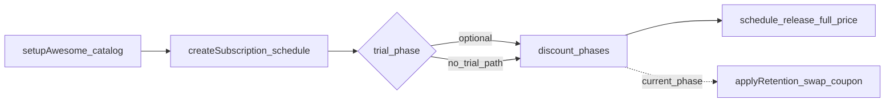
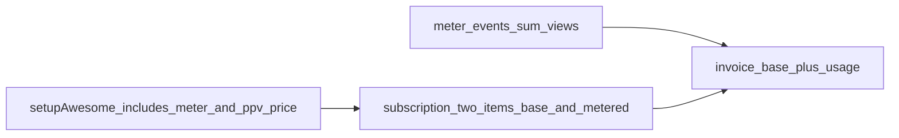

# TeeSwag use cases covered in this repository

## Purpose

This document connects the partner scenario in [Partner Presentation Case.pdf](Partner%20Presentation%20Case.pdf) to what **this codebase actually prototypes** today. It separates **business intent** from **implemented scripts** so stakeholders know what is demonstrated in Stripe test mode versus what remains presentation or future product work.

## Business context (partner brief)

After launching subscriptions, TeeSwag explores a **video streaming** offering to bundle with promotions for their core apparel business. The brief describes:

- **Package-style subscriptions** with **time-phased discounts** (for example, a steep introductory discount, then a moderate discount, then standard recurring price).
- **Launch promotions**, including something like **first month free**.
- **Retention offers** for subscribers who consider canceling (for example, an ad-hoc stronger discount).

The same brief also lists **topics to discuss** with Stripe Billing and related products (plan modeling, metered usage, Invoicing, connectors, billing cycles, Smart Retries, subscription health). **Metered usage** is partially automated via pay-per-view (see below); other themes stay narrative-only where noted.

## Use cases implemented in this repo

Each item below maps **intent → how to run or inspect it** in code.

### Catalog bootstrap

**Intent:** Ensure a repeatable Stripe catalog for demos (product, recurring price, coupons) without manual Dashboard clicks.

**Implementation:** Idempotent setup creates the **Awesome** product (`prod_awesome`), a monthly **EUR** price with lookup key `awesome_monthly_eur`, percentage coupons used by schedules (including retention variants), plus a separate **PPV** product (`prod_awesome_ppv`), a **Billing meter** (`event_name` `ppv_view`, sum aggregation), and a **metered** price (`awesome_ppv_view_eur`, **EUR 2.99 per view** per monthly period).

| How to run              | Source                                                                                                                           |
| ----------------------- | -------------------------------------------------------------------------------------------------------------------------------- |
| `npm run setup:awesome` | [`src/scripts/setupAwesome.ts`](../src/scripts/setupAwesome.ts), [`src/lib/stripeIdempotent.ts`](../src/lib/stripeIdempotent.ts) |

### Phased subscription schedule (“In the News”–style ladder)

**Intent:** Model **sequential pricing phases**—heavy discount, then lighter discount, then **full list price** after the schedule completes (`end_behavior: release`).

**Implementation:** A **Subscription Schedule** attaches one recurring price per phase; discount phases use coupons; after the last phase the subscription continues **without** the schedule wrapper.

| How to run                    | Source                                                                                                                                     |
| ----------------------------- | ------------------------------------------------------------------------------------------------------------------------------------------ |
| `npm run create:subscription` | [`src/scripts/createSubscription.ts`](../src/scripts/createSubscription.ts), [`src/lib/awesomeSchedule.ts`](../src/lib/awesomeSchedule.ts) |

**Nuance vs the PDF example:** The partner brief mentions **90% off for an initial period** and **50% off for a longer follow-on period** (for example, three months then six months). The default script uses **three months at 90%** and **three months at 50%**—a deliberate **prototype shape**, not a verbatim copy of every number in the PDF. Coupons are still named with “3m” in their ids; durations are set per phase in the script.

### Introductory “first period free”

**Intent:** Approximate **first month free** (or similar) **before** coupon-backed discount phases.

**Implementation:** An initial phase uses Stripe’s **trial** behavior (`trial: true` on the phase), followed by discounted phases.

| How to run                          | Source                                                                                                                                                  |
| ----------------------------------- | ------------------------------------------------------------------------------------------------------------------------------------------------------- |
| `npm run create:subscription:trial` | [`src/scripts/createSubscriptionWithTrial.ts`](../src/scripts/createSubscriptionWithTrial.ts), [`createAwesomeSchedule`](../src/lib/awesomeSchedule.ts) |

**Phase lengths in this script:** **1 month trial**, then **2 months at 90%**, then **3 months at 50%** (then release). This differs from the no-trial script’s **3 + 3** discount-only phases—both are intentionally parameterized in code.

### Simulated billing over time

**Intent:** Advance subscription and invoice timelines **without waiting** on wall-clock time.

**Implementation:** Each subscription script creates a **test clock** and a customer bound to it, attaches the test payment method `pm_card_visa`, and optionally advances simulated time by **`month N` / `m N`** (in **two-month steps** internally because of Stripe constraints with monthly subscriptions).

| How to run                                                                                  | Source                                                           |
| ------------------------------------------------------------------------------------------- | ---------------------------------------------------------------- |
| `npm run create:subscription` / `npm run create:subscription:trial` with optional `month N` | [`src/lib/testClock.ts`](../src/lib/testClock.ts), scripts above |

### Base subscription + metered pay-per-view (same subscription)

**Intent:** Offer a **flat recurring base** (streaming catalog access) and **usage-based pay-per-view** (exclusive title unlocks) on **one subscription**—one billing cycle and **one invoice** combining the licensed line item and summed meter usage.

**Implementation:** `subscriptions.create` with **two items**: licensed monthly price + metered price tied to a Billing meter. Usage is reported with **Billing Meter Events** (`stripe.billing.meterEvents.create`): one event per view, `payload.value` incrementing the meter’s sum (industry-standard **per-view** model; **per-minute** would use the same meter pipeline with different `value` semantics).

| How to run                                                                              | Source                                                                                                                                                                                                                                                                                                     |
| --------------------------------------------------------------------------------------- | ---------------------------------------------------------------------------------------------------------------------------------------------------------------------------------------------------------------------------------------------------------------------------------------------------------- |
| `npm run create:subscription:ppv` with optional `views K` / `v K` and `month N` / `m N` | [`src/scripts/createSubscriptionWithPpv.ts`](../src/scripts/createSubscriptionWithPpv.ts), [`src/lib/createBaseWithPpvSubscription.ts`](../src/lib/createBaseWithPpvSubscription.ts), [`src/lib/recordPpvViews.ts`](../src/lib/recordPpvViews.ts), [`src/lib/ppvConstants.ts`](../src/lib/ppvConstants.ts) |

### Retention / win-back offer

**Intent:** When a subscriber is in a **discount phase**, replace the **current phase’s** coupon with a **stronger** retention coupon to reduce churn.

**Implementation:** Loads the subscription’s active schedule, finds the **current phase**, and updates that phase’s discount while preserving other phases. **Mapping:** **90% → 100%**, **50% → 70%**. Retention coupons are created on demand if missing. Phases with **no** subscription-level coupon (for example, **trial-only**) cannot receive this swap—the code errors with a clear message.

| How to run                           | Source                                                                                                                           |
| ------------------------------------ | -------------------------------------------------------------------------------------------------------------------------------- |
| `npm run apply:retention -- sub_...` | [`src/scripts/applyRetention.ts`](../src/scripts/applyRetention.ts), [`src/lib/applyRetention.ts`](../src/lib/applyRetention.ts) |

### Operator and developer ergonomics

**Intent:** Jump from terminal output to the right Stripe Dashboard context during demos.

**Implementation:** Subscription scripts print a **test-mode-aware** subscription URL from the secret key prefix.

| Concern                                           | Source                                                  |
| ------------------------------------------------- | ------------------------------------------------------- |
| Dashboard deep link                               | [`src/lib/dashboardUrl.ts`](../src/lib/dashboardUrl.ts) |
| Automated regression against Stripe (test clocks) | [`tests/integration/`](../tests/integration/)           |

## Flow overview

**Metered PPV (base + usage on one subscription):**

## Partner-assessment topics not automated here

The PDF asks presenters to reason about several Stripe areas. **This repository does not ship end-to-end demos or scripts** for all of them:

- **Stripe Invoicing** as a standalone deep dive (custom PDF/branding, line items outside Billing).
- **External connectors** and third-party sync.
- **Multiple unrelated billing cycles** for the same customer in one narrative flow.
- **Smart Retries** configuration and dunning storytelling beyond what invoices implicitly show.
- **Subscription health** dashboards, churn analytics, and operational reporting.

Treat those as **talking points** or future build-out—not as guaranteed coverage in `npm run` scripts.

## Stripe operating principles (presentation context)

[Stripe Operating Principles.md](Stripe%20Operating%20Principles.md) captures how Stripe describes its culture (for example, users first, craft, urgency, collaboration). It supports **how** you might frame a partner or interview presentation; it does **not** define product use cases in this repo.

---

For commands and project layout, see the root [README.md](../README.md).
